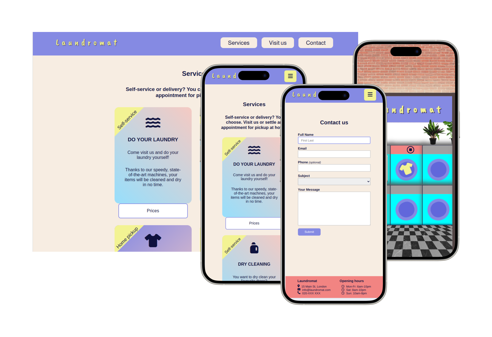

# Laundromat - A Native CSS Website for a Fictitious London Laundrette

## Introduction

Welcome to Laundromat, your virtual tour of a modern and bustling laundry salon nestled in the heart of London. This project showcases the seamless integration of HTML and native CSS to bring to life the online presence of this fictitious establishment.

## About Laundromat

Laundromat is a conceptual project aimed at exploring the potential of plain CSS in crafting a visually appealing digital experience alongside with an equally functional website.

Laundromat is not your average laundromat website. It's a playground of cool, youthful vibes, where CSS takes center stage to transform the mundane into the extraordinary. Focussing on delivering the special feeling akin to stepping into a real laundry salon, the essence of London's vibrant culture has been infused into every pixel.

## Features

- **Immersive Design**: Experience the charm of London Laundromat through carefully crafted CSS animations that emulate the ambiance of a bustling laundromat.
- **Responsive Layout**: This website is designed to adapt seamlessly to various screen sizes, ensuring an optimal viewing experience across devices.
- **Interactive Elements**: While restricting everything to HTML and CSS only, interactive elements have been incorporated for enhanced user engagement.

## Preview

## Take a look

To explore it yourself, simply access [Laundromat's website](https://hannahnier.github.io/Laundromat/) and do some virtual laundry there. Cheers from Laundromat! 🧺🌟
